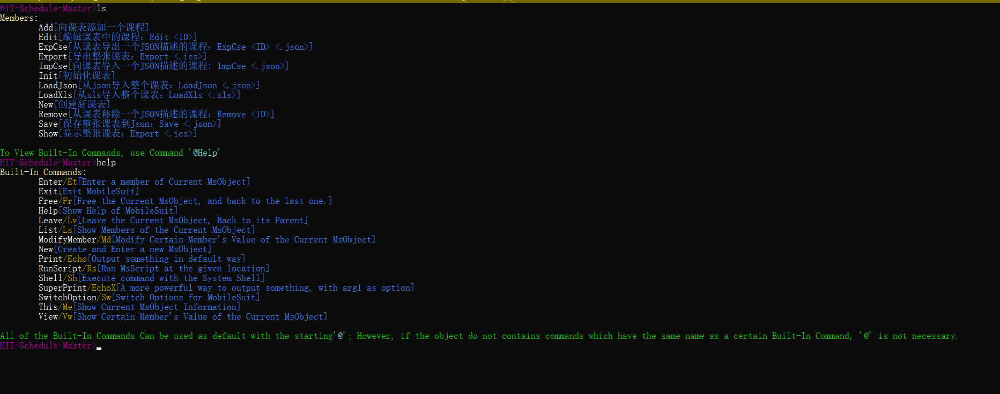
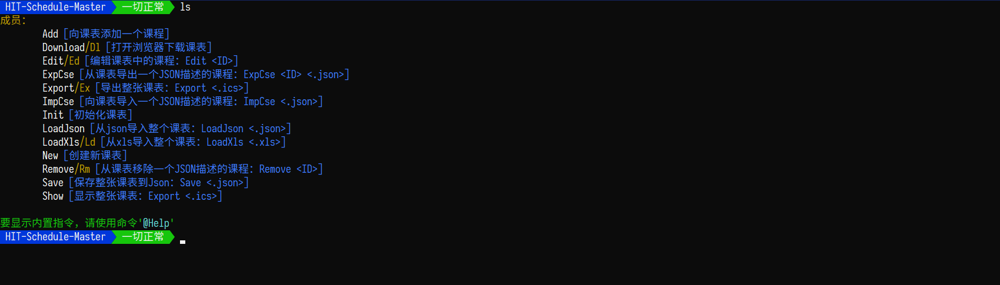

    

# PlasticMetal.WebSuit

 

[View at Nuget.org](https://www.nuget.org/packages/PlasticMetal.WebSuit/)

WebSuit provides an easy way to quickly build a .NET Web Console App. **It's still under development.**

Focus on writing the backend part, Import PlasticMetal.WebSuit, and simply write a Frontend in a very simple standard, then a beautiful Console App is born.

For Example: HIT-Schedule-Master CLI 

with PowerLine theme & I18N support

[View Documentation](https://plastic-metal.github.io/WebSuit/)